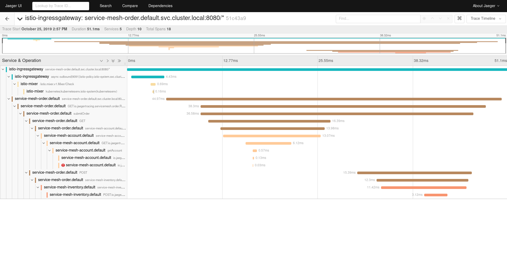

This is the demo code used for the presentation https://devoxx.be/talk/?id=19503["Observing chaos: how distributed tracing brings observability to a service mess"] for Devoxx'19.

Take a look at the `script.sh` file and execute each command step by step. Note that it wasn't meant to be executed as a whole, as some steps require some resources to be ready (like when `istio-demo.yaml` is applied).

The final result should look like this (or perhaps with even more spans, depending on Istio's mood):

